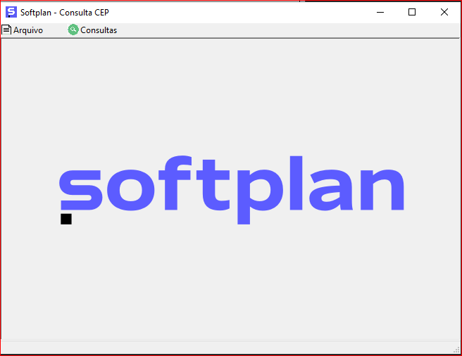
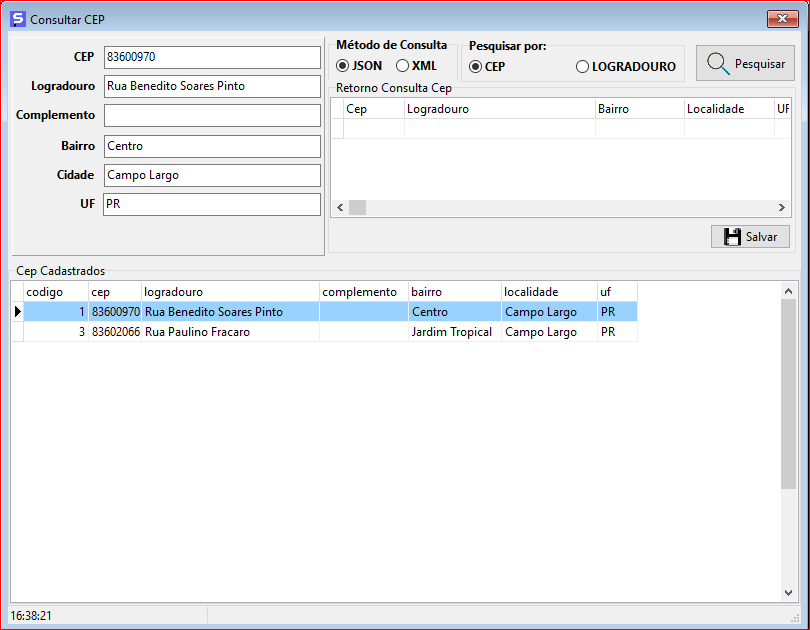
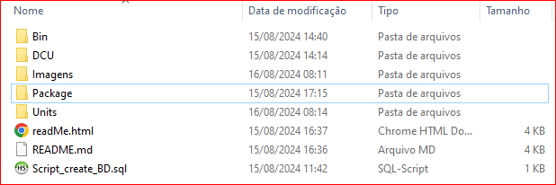
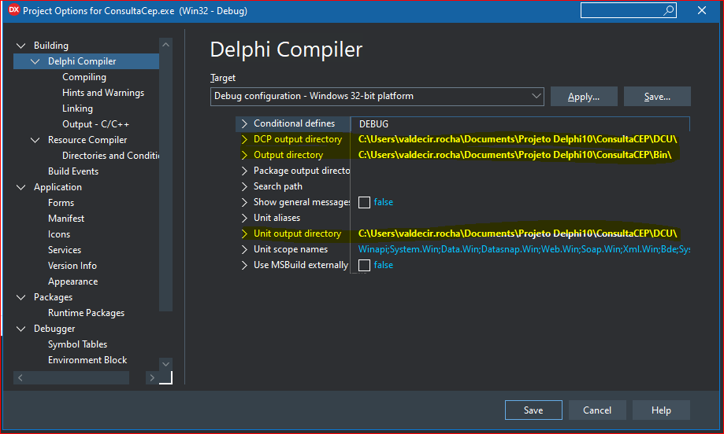

<h1 align="center">
    
</h1>

 <a href="#-sobre-o-projeto">Sobre</a> •
 <a href="#-funcionalidades">Funcionalidades</a> •
 <a href="#-layout">Layout</a> • 
 <a href="#-como-executar-o-projeto">Como executar</a> • 
<a href="#-entendendo-as-pastas-do-projeto">Entendendo as pastas do projeto</a> • 	
 <a href="#-autor">Autor</a> • 

## 💻 Sobre o projeto

♻️ ConsultaCEP - É uma aplicação com objetivo de consumir o WS da VIACEP.

**Optei por estabelecer a conexão com o banco de dados somente no momento em que é necessário gravar ou atualizar informações. Dessa forma, minimizamos o risco de falhas na aplicação devido à ausência de conexão com o banco.**

Projeto desenvolvido durante o desafio técnico aplicado pela **[Softplan]**.

Projeto desenvolvido em **Delphi 10.3** e banco de dados **Mysql 5.7.23**

---

## Layout

A tela da aplicação é bem simples e objetivo:

<h1 align="center">
    
</h1>

---

## ⚙️ Funcionalidades

- [x] **Consulta Cep via Json:**

  - [x] Utilizando o código do CEP
  - [x] Utilizando o Estado, Cidade, e nome da rua

- [x] Grava na base de dados o CEP pesquisado
  - [x] Se já existe, atualiza o CEP na base de dados
  - [x] Se não existe, insere o CEP na base de dados

- [x] **Consulta Cep via Xml:**
  - [x] Utilizando o código do CEP
  - [ ] Utilizando o Estado, Cidade, e nome da Rua   

- [x] Grava na base de dados o CEP pesquisado
  - [x] Se já existe, atualiza o CEP na base de dados
  - [x] Se não existe, faz insert o CEP na base de dados

### Pré-requisitos

Antes de começar, você vai precisar ter instalado em sua máquina as seguintes ferramentas:

Mysql : https://dev.mysql.com/downloads/windows/installer/5.7.html

💡Os códigos-fontes podem ser abertos em **algumas versões anteriores do Delphi**, desde que já tenha o componente de banco **Firedac nativo**.

---

## 🚀 Como executar o projeto

💡Baixar todo o repositorio do git e descompactar de preferencia numa pasta na unidade c:

---

### 🚀 Entendendo as pastas do projeto

<h1 align="center">
    
</h1>

- Bin: ✨Pasta onde está o binário da aplicação **ConsultaCep.exe** e a dll de conexão do mysql do banco de dados **libmysql.dll**

- DCU: ✨Pasta onde estão os DCU's da aplicação

- Imagens: ✨Pasta onde estão imagens utilizados na aplicação e no repositório do GitHub e icones

- Package: ✨ Pasta onde estão os arquivos do projeto em Delphi (**DPR, DPROJ E RES**)

- Units: ✨ Pasta onde estão todas as units do projeto (**códigos-fonte**)

- Script_create_BD.sql: ✨ Rodar o script de geração do banco de dados antes para evitar erros.

---

#### 1) Instalação Mysql🎲

💡Baixe o instalador do [Site]( https://dev.mysql.com/downloads/windows/installer/5.7.html)

---

### 🧭 Rodando a aplicação no Delphi 10

💡**Acertar os diretórios de compilação do projeto no menu Project>Options>Delphi Compiler> Target**

- 💡**DCP output directory >>> Diretório onde descompactou\ConsultaCEP\DCU**

- 💡**Output directory >>> Diretório onde descompactou\ConsultaCEP\Bin**

- 💡**Unit output directory >>> Diretório onde descompactou\ConsultaCEP\DCU**

<h1 align="center">
    
</h1>

Ao compilar o projeto no Delphi, será gerado o arquivo **ConsultaCep.exe** dentro da pasta Bin verificar se o arquivo **libmysql.dll** esta na pasta.

---

## 🛠 Tecnologias

As seguintes ferramentas foram usadas na construção do projeto:

#### **Aplicativo Desktop -->> Delphi + Mysql**

---

## 🦸 Autor

[Entre em contato!](https://www.linkedin.com/in/valdecir-antonio-rocha-desenvolvimento/)

---
