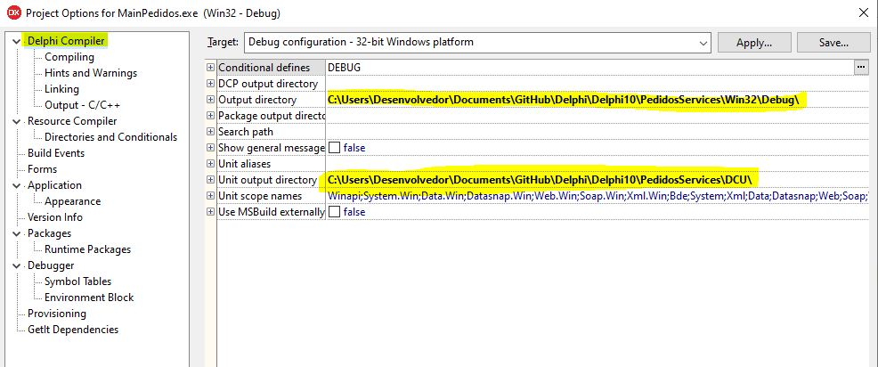

 <a href="#-sobre-o-projeto">Sobre</a> •
 <a href="#-funcionalidades">Funcionalidades</a> •
 <a href="#-como-executar-o-projeto">Como executar</a> • 
<a href="#-entendendo-as-pastas-do-projeto">Entendendo as pastas do projeto</a> • 	
 <a href="#-autor">Autor</a> • 

## 💻 Sobre o projeto

♻️ Pedidos status - É uma aplicação de serviço com objetivo de vericiar status de pedidos.

**Optei por estabelecer a conexão com o banco de dados somente no momento em que é necessário gravar ou atualizar informações. Dessa forma, minimizamos o risco de falhas na aplicação devido à ausência de conexão com o banco.**

Projeto desenvolvido durante o desafio técnico aplicado pela **[Softgran]**.

Projeto desenvolvido em **Delphi 10.2** e banco de dados **Firebird 3.0**

## ⚙️ Funcionalidades

Verifica Pedidos Pendentes de Processamento 
● A cada 10 segundos, o serviço deve consultar uma tabela PEDIDOS no banco de dados 
Firebird e buscar registros com STATUS = 'AGUARDANDO'. 

Máquina de Estados 
Os pedido passam por uma máquina de estados com a seguinte lógica: 
AGUARDANDO → PROCESSANDO → CONCLUIDO → FALHA (se erro)

### Pré-requisitos

Antes de começar, você vai precisar ter instalado em sua máquina as seguintes ferramentas:

Firebird : https://firebirdsql.org/en/firebird-3-0-3/

💡Os códigos-fontes podem ser abertos em **algumas versões anteriores do Delphi**, desde que já tenha o componente de banco **Firedac nativo**.

---

## 🚀 Como executar o projeto

💡Baixar todo o repositorio do git e descompactar de preferencia numa pasta na unidade c:

---

### 🧭 Rodando a aplicação no Delphi 10

💡DCP output directory >>> Diretório onde descompactou\PedidosServices\DCU

💡Output directory >>> Diretório onde descompactou\PedidosServices\Bin

💡Unit output directory >>> Diretório onde descompactou\PedidosServices\DCU

💡**Acertar os diretórios de compilação do projeto no menu Project>Options>Delphi Compiler> Target**

<h1 align="center">
    
</h1>

Ao compilar o projeto no Delphi, será gerado o arquivo **MainPedidos.exe** dentro da pasta Bin.

**Arquivo ini:**
Toda a configuraçõa de banco de dados é carregada pelo aquivo ini que se encontra junto com o **MainPedidos.exe**.
Data base: 
Diretorio base de dados: \DataBase\DATABASE.FDB que se encontra junto com o **MainPedidos.exe** dentro da pasta DataBase.

 

**Instalar o Serviço:** 
Abra o Prompt de Comando como administrador:
Pressione Win + S, digite cmd, clique com o botão direito em "Prompt de Comando" e selecione Executar como administrador.
Navegue até o diretório onde o MainPedidos.exe está localizado: cd caminho\para\seu\projeto\MainPedidos

<h1 align="center">
    
</h1>

 
● copie MainPedidos.exe /install

 

**Iniciar o Serviço:** 
● net start Pedidos

 

Observe O nome do serviço é Pedidos verifique se esta rodando no gerenciador de tarefas aba detalhes.
Existe um arquivo ServicoLog.txt que se encontra junto com o **MainPedidos.exe** que é gerado para em conjunto com a tabela LOG .

 

**Parar o Serviço:** 
● net stop Pedidos

 

**Desinstalar o Serviço:** 
● MainPedidos.exe /uninstall

 

---

## 🛠 Tecnologias

As seguintes ferramentas foram usadas na construção do projeto:

#### **Aplicativo Desktop -->> Delphi + Firebird 3.0**

---

## 🦸 Autor

[Entre em contato!](https://www.linkedin.com/in/valdecir-antonio-rocha-desenvolvimento/)

---
